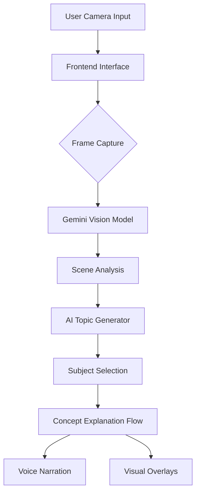

# 🌍 Learnscape
Turn the world into your classroom.

Learnscape is an AI-powered visual learning system that helps users explore the physics, chemistry, and mathematics behind real-world objects. By pointing a camera at everyday objects, the system analyzes them using multimodal AI and generates contextual explanations, diagrams, and voice interactions to turn the environment into an interactive STEM learning experience.

---

## 🚀 Core Features

1. **Object-Based Learning**: Users point their camera at a real-world object and the system identifies relevant scientific concepts related to it.
2. **AI Concept Generation**: The AI determines whether the object relates to physics, chemistry, or mathematics and suggests concepts that can be explored.
3. **Visual STEM Overlays**: The system generates educational diagram overlays such as force vectors, equations, structural diagrams, or chemical reactions directly on the camera feed.
4. **Voice Interaction**: Users can interact using voice to ask questions and receive spoken explanations via browser speech synthesis.
5. **Interactive Concept Exploration**: Users can select different domains (Physics, Chemistry, Math) and explore multiple STEM concepts related to the same object.
6. **Learning Snapshot**: Users can capture the frame to save a visualized lesson including diagrams and explanations.

---

## 🏗 System Architecture

### Detailed Data Flow
1. **User Camera Input**: Real-time video stream from the device camera.
2. **Frontend Interface**: React-based UI with camera view and interactive overlays.
3. **Frame Capture**: Capturing a specific frame as a data URI for analysis.
4. **Vision Model Analysis**: Gemini 1.5 Flash identifies the primary object and its properties.
5. **AI Agent Reasoning**: Genkit flows orchestrate the generation of subjects and specific STEM concepts.
6. **Generated Outputs**: Conversational text explanations and synchronized voice narration.

---

## 🤖 Generative AI Approach

Learnscape uses multimodal generative AI to dynamically create contextual learning content.

1. **Vision Understanding**: The system analyzes the camera feed to detect objects, materials, and structural features.
2. **Language Model Reasoning**: A large language model interprets the detected object and determines relevant STEM concepts.
3. **Agent-Based Logic**: An AI agent selects appropriate domains such as physics, chemistry, or mathematics and decides which concepts to explain.
4. **Generated Outputs**: The system produces voice explanations, concept summaries, and visual diagram suggestions.

---

## 🛠 Tech Stack

| Layer | Technologies |
|------|-------------|
| **Frontend** | Next.js 15, React 19, Tailwind CSS, ShadCN UI |
| **AI Framework** | Genkit AI |
| **AI Models** | Gemini 1.5 Flash (Multimodal) |
| **Services** | Browser Speech Synthesis (TTS) |
| **Icons** | Lucide React |

---

## ⚡ How It Works

1. **Scan**: Point the camera at an object and tap the capture button.
2. **Detect**: AI identifies the object and suggests STEM subjects (Physics, Chemistry, Math).
3. **Explore**: Select a subject and choose a specific concept from the dynamic stack.
4. **Learn**: Listen to a conversational explanation tailored to the object in view.

---

## 🌱 Example Use Cases

- **Physics**: Understanding rotational motion by scanning a bicycle wheel.
- **Chemistry**: Learning about oxidation by scanning a rusted metal gate.
- **Math**: Observing geometric symmetry in architectural structures.

---

## License
MIT
